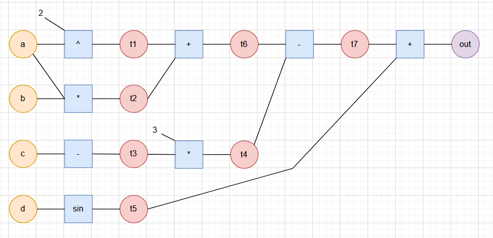
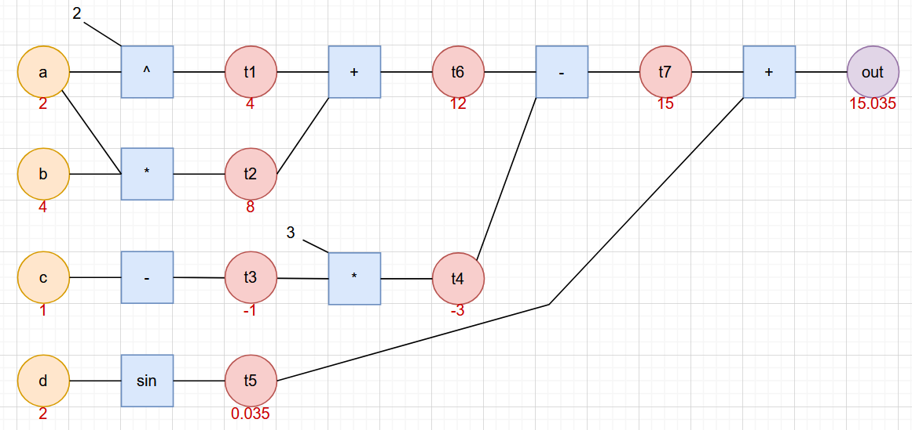
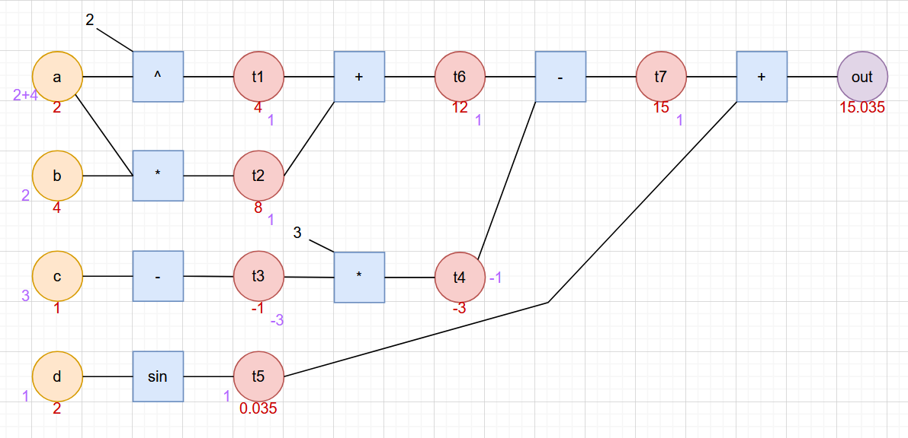
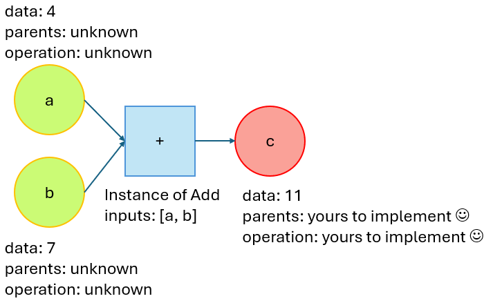
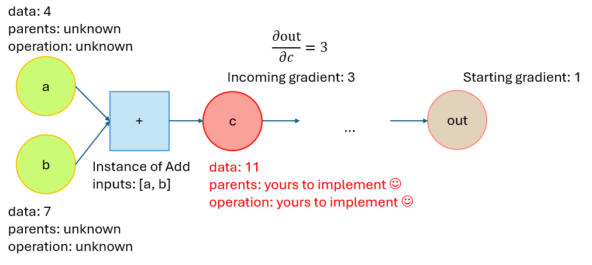

# Final project - An Automatic Differentiation (_autodiff_) engine

For the final project of OOP, you're required to implement a small and lightweight engine for **automatic differentiation** that handles operations and calculate the gradients of the operation.

Autodiff is at the core of modern Machine Learning.
In order to modify the parameters of a model to minimize a loss function, gradient descent is often employed.
Gradient descent is an iterative procedure that works over $T$ time steps, each time updating the parameters of the model to reduce the error represented by the loss function.
This is the fundamental part of **training**.

If we call the parameter of the model $\Theta$, and add a subscript $\Theta_t$ to indicate the time step of the training procedure, the update happens via this formula:

$\Theta_{t+1} \leftarrow \Theta_{t} - \eta \nabla\mathcal{L}_\Theta$

Where $\eta \in \mathbb{R}^+$ is a hyperparameter called *learning rate* (which controls the step size of the optimization process) and $\nabla\mathcal{L}_\Theta \doteq \frac{\partial\mathcal{L}}{\partial \Theta}$ is the **gradient** of the loss with respect to the parameters.
You can see how it is fundamental to have a way to automatically compute the gradients to enable training.

## Automatic differentiation and computation graphs

Let us stick to scalars, without considering vectors or matrices.
For example, we have four initial variables $a, b, c, d \in \mathbb{R}$.
We compute the following formula:

$$
f(a,b,c,d) = a^2 + a*b - 3c + \sin(d)
$$

We can represent all variables involved in the computation as **nodes** (we use different color for input, temporary, and output nodes).
We draw each atomic operation with a square.



To get the output of the formula $\text{out}\doteq f(a,b,c,d)$, we can substitute the values of $a,b,c,d$ with their actual values (e.g., 2, 4, 1, 2) and traverse the path **_forward_** and get the output value 15.035.



In order to compute the gradients, we traverse the path **_backwards_**, from the output to the input, each time using the rules for calculating the derivatives.

The first two dervatives we can compute are $\frac{\partial \text{out}}{\partial t_7}$ and $\frac{\partial \text{out}}{\partial t_5}$.

$\frac{\partial \text{out}}{\partial t_7} = 
\frac{\partial (t_7 + t_5)}{\partial t_7} = 1$

Same goes for $\frac{\partial \text{out}}{\partial t_5}$.

A derivative we can now compute is $\frac{\partial \text{out}}{\partial t_6}$ and $\frac{\partial \text{out}}{\partial t_4}$:

$\frac{\partial \text{out}}{\partial t_6} = 
\frac{\partial \text{out}}{\partial t_7} \cdot \frac{\partial t_7}{\partial t_6} = 1\cdot \frac{\partial (t_6 - t_4)}{\partial t_6} = 1$

$\frac{\partial \text{out}}{\partial t_4} = 
\frac{\partial \text{out}}{\partial t_7} \cdot \frac{\partial t_7}{\partial t_4} = 1\cdot \frac{\partial (t_6 - t_4)}{\partial t_4} = -1$

Also, we can compute 

$\frac{\partial \text{out}}{\partial d} = 
\frac{\partial \text{out}}{\partial t_5} \cdot \frac{\partial t_5}{\partial t_4} = 1\cdot \frac{\partial \sin{t_4}}{\partial t_4} = \cos(t_4) = \cos(0.035) = 1$

We can progress in this way to compute the other gradients...

When one node has multiple outgoing operations, the gradients are summed (you have an example with $\frac{\partial \text{out}}{\partial a}$, since $a$ is present in multiple computations).

$$
\frac{\partial \text{out}}{\partial a} = \underbrace{\frac{\partial \text{out}}{\partial t_7}\frac{\partial t_7}{\partial t_6}\frac{\partial t_6}{\partial t_1}\frac{\partial t_1}{\partial a}}_{=2a} + \underbrace{\frac{\partial \text{out}}{\partial t_7}\frac{\partial t_7}{\partial t_6}\frac{\partial t_6}{\partial t_2}\frac{\partial t_2}{\partial a}}_{=b} = 2a + b = 2(2) + 4 = 8
$$


You can see the final result in the figure (gradients indicated in blue):


The extension to vector and matrices seems complex, but we will explore it with guided steps, as in the instructions provided below...

## Your tasks

Implement an automatic differentiation engine for the operations indicated in the [summary table](#operations-to-implement).

You will incrementally construct an autodiff engine for vectorial and matricial data, starting from a basic implementation

### Part 1: the basics

In part 1, you will construct an engine that computes the **forward pass** for scalar data for simple operations.

The components of the engine for this simple program are two: the `Variable` and the `Operation`.

#### The `Variable`

This class encodes any of the nodes in the computation graph, be them initial nodes, terminal nodes, or intermediate nodes.
In this step, `Variable` is defined by the following properties:
* Data: this is the value of the scalar. This is a `np.ndarray`: even if now this detail seems irrelevant (_why not make it a float?_), it is better to start working with arrays, so we already have a nice scheme for later.
<!--* Parents: this contains a pointer to the (up to) two parents.-->
* Operation: this property encodes the operation that _spawned_ the `Variable`. This is necessary for non-initial nodes: since the final goal is to implement a backward pass, we need to record which operation created the variable, so we can correctly implement the logics for the gradient computation. The operation is of type `Operation` (which will be defined soon).

When constructing the `Variable`, allow passing all of these two properties as arguments; however, consider whether you need defaults for the Operation.

Provide a getter for the Data. You should also provide a setter, but only if it makes sense (i.e., you will be using it at any time during the implementation and that must be the _only_ way you will be able to implement that given feature).

_**Tip:**_ sometimes, preventing leakage via deep copy can be very intensive for memory.
If dealing with numpy arrays, we can create a read-only view of the array with the following script:

```python
numpy_array = np.array([1,2,3])
safe_view = numpy_array.view() # safe_view points to numpy_array
safe_view.flags.writeable = False # but this protects safe_view from modifications
```

This will create a "safe view" of the array which cannot be written. You can try it yourself:

```python
safe_view[0] = 2 # this fails
numpy_array[0] = 2 # this runs correctly
```

#### The `Operation`

Now that we have defined the skeleton of the `Variable`, we can talk about `Operation`s.
They are classes that define the simple operations between scalars we will be performing.
For now, we will only be implementing addition, multiplication, and sine.

`Operation`s are defined by the operation that they carry out. They only have an attribute, which is the input `Variable`s (one or two, depending on the type of nature of the operation).
The operation is constructed without arguments - just initialized the inputs to None, or an emtpy list/tuple, depending on how you want your class to look like.

`Operation`s are carried out using by providing a functional interface to the classes. E.g., if your addition operation class is called `Add` and you instantiate it as `add = Add()`, you should be able to perform the addition operation by calling `add(a, b)` where `a` and `b` are other `Variable`s.
This information should be enough to provide you with the input arguments and the specific 'magic' method you're supposed to construct :)

For what concerns the body of this method, the method should return a new variable - it effectively _spawns_ it.
The Data of this new variable is the result of the operation: in case of the addition, it is going to be the addition between the Data of the two input variables; in case of the sine, it is going to be the sine of the input variable.
Be careful to correctly set the operation of the spawned node.
Return this new node.

This image summarizes the procedure we are trying to implement, the `Variable` `c` being the output of the method:



It is not time for abstraction and concretization:
implement and ABC for a generic `Operation` and three concrete classes inheriting from this ABC: `Add`, `Multiply`, and `Sine`.
Be careful to identify possible sources of duplication within the functioning of these three operations. Use the ABC to remove as much as possible these duplications by **only making abstract what really needs to be abstract**, even if you need to create new methods in the process.

At this stage, if you implement correctly the three concrete operations, they should take up maximum 3 lines of code each. 

#### Finalizing the `Variable`

Now that we have implemented the `Operation`s, we can implement them in the `Variable`.

Overload the operators `+` and `*` in `Variable`.
Inside these methods, you should return an anonymous instance of the requested operator which acts on `self` and another instance of `Variable` which is passed as argument to the method.
To be slightly more indicative of what you need to do, here is a code snippet:

```python
def __magic_method_that_overloads_+__(self, arguments):
    return Add()(...arguments...)
```

Implement something similar for `Sine`, taking into consideration that:
* you shouldn't overload operators for that; just creating a `sine` or `sin` method of `Variable` will be enough.
* the sine is a unary operator, not a binary operator - thus, its functioning will be slightly different than + and -.

Before we start testing our first implementation, we should create a printable version of the `Variable`, so we can inspect it.
Printing the data and the operation for now should be fine.
<!--If you print the parents, you might have a bad time reading the output later, but feel free to try it to see the result :)-->

#### A first main

If you implemented everything insofar, you can start doing some experimentations.
In the main, define some floats, pass them to `Variable`s and try to mix them up by combining addition, multiplication, sine.
Print the initial `Variable`s and the one you defined by combining the initial ones, and check if their value matches.

You may incur in circular import errors. If that is the case, remember to add `from __future__ import annotations` in the modules involved by the error and avoid importing names from modules:
i.e., avoid calling `from .operation import Add, Multiply`, but rather do `import operation` and, later on, in the code, refer to `Add` as `operation.Add`.

These are the things we still need to do:

* You will notice that non-`Variable` scalars are still not admitted in our computations: if `a` is a `Variable`, code such as `2 * a` or `a * 2` will fail, since `2` is not a `Variable`.
* We still have not computed any gradients.
* We still need to extend the functioning to multi-dimensional inputs.

### Part 2: adding the backward pass

We can now start planning the implementation of the backward pass.
The idea we want to implement is simple: we want to provide both `Variable`s and `Operation`s with a `backward` method.
Calling `backward` on a non-initial node will act as a _trigger_ to start the gradient computation, calling the `backward` on its operation, which will compute the gradients, distribute them to the inputs, then calling `backward` on them in a recursive fashion, until we reach initial nodes, which have no operations connected to them.

#### `Operation` backward

Let's start from the `backward` of the `Operation`:
this method accepts an incoming gradient (which is passed from the `Variable`, we will come to it later) and distributes the gradients to its children.
The specific computation of the gradient depends on the operation itself.

Let us consider the toy example from before and suppose we receive, from the output of the graph, an incoming gradient of 3:



This quantity is defined as the gradient of the output w.r.t. `c`: $\frac{\partial{\text{out}}}{\partial c} = 3$.
Our next step is to compute the gradient of `out` w.r.t. `a` and w.r.t. `b`.
Because of the chain rule, we know $\frac{\partial{\text{out}}}{\partial a} = \frac{\partial{\text{out}}}{\partial c}\cdot \frac{\partial c}{\partial a}$.
We also know that $c = a+b$, so:
$\frac{\partial c}{\partial a} = \frac{\partial (a + b)}{\partial a} = 1$.
By substituting this result into the computation before, we get that $\frac{\partial{\text{out}}}{\partial a} = 1 \cdot 3$.

We can recover the same outcome for $\frac{\partial{\text{out}}}{\partial b}$

We have discovered the first fundamental property of the backward pass - addition _copy-pastes_ gradients onto its inputs.

From the point of view of our code, we will be calling the `backwards` on the input `Variable`s (_not implemented yet_) by passing the same incoming gradient on both of them.

Work out the gradient formula for multiplication and sine and implement it autonomously. _Note: you will need to take into considerations the `data` of the input `Variables` for that_.

#### `Variable` backward

Moving on to `Variable`, the situation seems simple, but there are some quirks to consider.

* First of all: we should consider that a `Variable` also has a `gradient`. We should consider adding it to the attributes, but don't let the user pass it as input to the constructor - just choose a default value for the initialization. Provide getter and setter, if needed. Be careful about leakage.

* Second of all: what is the base gradient from which we start the backpropagation if the `Variable` has no gradient?
You should start with a gradient of 1, then backpropagate this value on the operation.

* Third of all: what happens if this starter node already has a gradient? Then we backpropagate this value.

* Fourth: what happens if the node is not the one on which we originally call `backward`? If you go back to the requirement for `Operation`, you will notice that `Operation.backward` passes a gradient to `Variable.backward`.
So this represents an incoming gradient which is passed from `Operation` to `Variable`, and `Variable` needs to pass it on to its `Operation`.

* Fifth: what happens if the `Variable` receives a gradient from one of the children `Operation`s but it already has a gradient? Then the gradient needs to be accumulated. We already encountered this case in the introduction, whereas `a` had two children - notice how we have a summation of gradients there.

These bullet points should allow you to implement `backward` on the `Variable`. The concept is simple: gather the gradient coming from the `Operation`, accumulate it with the existing gradient (if such exists), then call `backward` on the `Operation`.
If this one doesn't exist, congratulations - you have reached a root `Variable`, and the recursion breaks ;)

As a final note, print the gradients as well in the `__str__` for an ease of visualization.

#### Experimenting with our backward

Now, try to play around with this newly-discovered weapon!

Create some simple computations between `Variable`s, then call `backward` on the resulting terminal `Variable` and see the effect.

You could also try to change the value of the initial gradients - if you implemented `backward` correctly, you could also call it with a non-default `incoming_gradient`, e.g., 5.

Do the computation by hand (on a computation graph you draw by hand) to check whether the values of the gradients match.


### Part 3: supporting vectors

This third step requires adding a dimension to our reasoning. Not a lot changes in your implementation, though.
If you do the maths, you'll quickly discover that the rules for our simple element-wise operations are the same as the scalar case.
We need to add some more clauses to our example:
* make sure you initialize the gradients with the same dimension as the data
* make sure the operations you implemented are applied on gradients of the same shape

Also, there is now a new issue: the gradient requires by definition that the terminal node is a scalar:

If you have $\frac{\partial y}{\partial x}$, you call it a gradient if $y\in\mathbb{R}$, but if $y\in\mathbb{R}^p$, then this becomes a Jacobian, which cannot be computed via this type of backpropagation.
So, we have to force this rule:
1. If the `Variable` we call backwards on is a scalar node, then we can operate backpropagation normally.
2. If the `Variable` instead is multidimensional and does not have an existing gradient, then we have to raise an error.

You will quickly realize that, with the current setting, we don't have any ways to reduce a vectorial `Variable` into a scalar, because sin, *, +, all return another vector.

We can remedy to this by defining a new `Operation` called `Sum` which reduces any np.ndarray to a scalar by summing all of its elements.
How does the gradient computation work in this case? This case is very similar to `Add`: the sum just distributes the incoming gradient to the input. The differences are:
1. Now there is only one input, not two.
2. The incoming gradient has a different shape then the input data. So, you will have to change the dimensions (I suggest using `np.broadcast_to` for the task).

With this new operation, you should be able to seamlessly have the engine work, provided all of the arrays in the binary operations have the same shape (they could even by n-dimensional!). Just do the computations, then reduce everything with `Sum` and run the backpropagation.

Now that you reached this step, you should create other `Operations` of your choice, deciding whether to overload or not exsting operators in the process. Remember to add also reduction operators (reductions take ndarrays and return a scalar).

### Part 4: working with non-`Variable` scalars

For admitting non-`Variable` scalars into the engine, we need to consider the errors we get when we try to mutliply a scalar with a `Variable`.

i) If, for instance, we do `a * 3`, we should get the following error: `AttributeError: 'int' object has no attribute 'data'`, since we are treating `3` as a `Variable`.

ii) In the opposite case, `3 * a`, we get a different error, related to the fact that now we are calling `*` on a scalar, an operator that certainly does not support `Variable`s on the right hand side!

For i), the solution is quite simple: just parse the scalar to a `Variable` when this is passed to the `Operation`!

For ii), you may discover that you need the magic method `__rmul_` :)

There should be only one missing step - you'll now discover that there is a mismatch in dimensions when backpropagating the gradients on the newly created scalar `Variable`: essentially, we're trying to pass a multidimensional gradient onto a scalar. 
The solution is quite simple here - we don't really care about these gradients, since these new `Variable`s are not really proper variables, but constants... So we can just create a flag, within `Variable`, to stop the backward flow when this `Variable` is reached.
You should work out how to make this flag work correctly ;)

One final step for this part - implement a `delete_gradient` method on the `Variable`. This is responsible for deleting the gradients starting from the terminal node on to the roots. You should be able to implement it quickly by using the node-traversing logic already implemented for `backward`, but this time just removing the gradients instead of computing them.

### Part 5: the autodiff engine and Multiple Linear Regression

We are almost ready to put our automatic differentiation engine to work on a real problem, like the multiple linear regression (MLR).

We need a small introduction.
During assignment 1, we trained MLR using an exact analytical formula that recovers the optimal set of parameters $\mathbf{w}^\star$ in one go, with the formula $\mathbf{w}^\star=(X^\top X)^{-1}X^\top \mathbf{y}$.
This is not the only choice to train the model.
We previously mentioned the existence of Gradient Descent (GD), which is an iterative procedure which updates the parameter according to their gradient with respect to a loss function.

In the context of MLR, GD works in this way.

0. Get a training dataset $(X, \mathbf{y})$ of $n$ statistical units; define a loss/performance function $\mathcal{L}(f(X), \mathbf{y})$. The default one is MSE: $\mathcal{L}(f(X), \mathbf{y}) = \frac{1}{n} \sum_{i=1}^{n}(f(X)-\mathbf{y})^2$; define a hyperparameter $\eta\in\mathbb{R}^+$ called **learning rate**.

1. Initialize randomly the parameters $\mathbf{w}$. An idea could be a draw from $\mathcal{N}(0,1)$ (_can you spot the slide from the lecture notes in which we already operated such draw?_). Let's call this set of parameters $\mathbf{w}_0$

2. Compute the output $f(X)_0$ using $\mathbf{w}_0$ as parameters.

3. Compute the loss $\mathcal{L}(f(X)_0, \mathbf{y})$.

4. Backpropagate and compute the gradients $\nabla_0 \doteq \frac{\partial \mathcal{L}(f(X)_0, \mathbf{y})}{\partial \mathbf{w}_0}$.

5. Update the parameters according to the GD formula: $\mathbf{w}_1 \leftarrow \mathbf{w}_0 - \eta \cdot \nabla_0$.

6. Delete gradients.

6. Repeat the steps 2-6 with the newly computed parameters (updating the iteration index in the formulae).

7. Stop when a set number of iterations $n_{\text{iter}}$ is reached.

Your task for this part is the following:

1. Create an operation for matrix multiplication, one for element-by-element raising to a power of n, one for the element-by-element absolute value, and one for the transposition. 
Despite seeming dauntlingly difficult to implement, the derivative of the matrix multiplication is quite simple to grasp.
Consider the operation $Z=XY$, where $X\in\mathbb{R}^{n\times p}$ and $X\in\mathbb{R}^{p\times q}$. 
Let us also consider an incoming gradient $\frac{\partial \text{out}}{\partial Z} \in \mathbb{R}^{n\times q}$ (the same shape as $Z$):

    * $\frac{\partial \text{out}}{\partial X} = \frac{\partial \text{out}}{\partial Z} Y^\top $
    * $\frac{\partial \text{out}}{\partial Y} = X^\top \frac{\partial \text{out}}{\partial Z} $

    For the implementation of the proper matrix-matrix multiplication operation, you should request that **only 2d np.ndarrays are passed**; you should raise an error otherwise.
    If you have to operate a matrix-vector multiplication, the vector should be formatted as a matrix (with either one column or one row, depending on the dimensions of the other matrix) - leave the user to figure out how to format the vector.

    For what concerns the transposition, the backward should simply transpose the incoming gradient.

1. Recover your code for `MultipleLinearRegression` from the first assignment. Make it work correctly by implementing the feedback from the TAs and lecturers.

2. Add one method called `fit_gradient_descent`. Implement the algorithm as described in the procedure above, leaving choice to the user on the choice of learning rate, loss function, and parameters initialization method. These two arguments **must** be implemented as functions.

3. In the `main`, showcase the training of the model using MSE, a learning rate of 0.1, and a standard Gaussian initialization.

4. Showcase another example of training in which the loss function is the LASSO loss:
$\mathcal{L}_{\text{LASSO}} = \frac{1}{n} \sum_{i=1}^{n}(f(X)-\mathbf{y})^2 + \lambda \cdot || \mathbf{w}||_1$, where  $\vert\vert \mathbf{w}\vert \vert_1$ indicates the one-norm of the parameters: $\sum_j |w_j|$.

### Part 6: extras

Feel free to explore further applications of the automatic differentiation engine:
* train a Ridge regression model (loss similar to LASSO but with L2 norm penalty instead of L1)
* train a Logistic regression model (functionally identical to linear regression model but with a sigmoid after the output and trained using log loss):
    * sigmoid function: $\sigma(x) = \frac{1}{1+e^{-x}}$
    * model: $f(X) = \sigma(X\mathbf{w})$
    * log loss: $\mathcal{L}(f(X), \mathbf{y})=-\mathbf{y}\log f(X)-(1-y)\log(1-f(x))$

   you will require to implement the sigmoid operation, plus a log operation and a unary minus operation (if you haven't done before)

* if you feel brave, you can even expand to other models, such as a small neural network trained with (non-stochastic) gradient descent.

### Operations to implement

| Operation | Description | Requireemnt of part |
|---|---|---|
| + | Addition | 1 |
| * (or $\odot$) | Element-by-element multiplication | 1 (+ 4) |
| sin | Element-by-element sine | 1 | 
| $\Sigma$ | Matrix summation | 3 |
| Matmul | Matrix-matrix multiplication | 5 |
| $\vert\cdot\vert$ | Absolute value | 5 |
| $\cdot^\top$ | Transposition | 5 |
| ^n | Power | 5 |
| - | Unary or binary minus (for mean squared error) | 5 |

Add at least three more operations (e.g., log, exp) of your liking as part III requirement.


### Demonstrations

As indicated in the section "Grading information", depending on which parts you complete, you will have to provide different sorts of demonstration to your code.

#### Part 3 demonstration:

Create at least five different vectors of your liking.
These vectors should be 1-dim numpy arrays.

Create a computation graph by passing these vector to `Variable`s and mixing them in the graph. You should use **all** of the implemented operations in the process (even the extra ones you implemented).

Make sure that _at least_ one of the variables involved has multiple children, so you can demonstrate the accumulation of gradients.

Make sure also that the last operation is a sum, so you can effectively compute the gradient.

An example could be:
```
(v1 * v2 + sin(v3) * v4 + v2 * v5).sum()
```

In the computation graph, `v2` has 2 children.

Print the output variable, the initial variables and their gradients.

#### Part 4 demonstration:

Delete the gradients from part 3, then construct another computation graph in which you make use of the multiplication for a constant scalar, for both the situations when this is to the left hand side or right hand side of the multiplication (i.e., `3 * v` or `v * 3`).

Again, print the output, inputs, and gradients.

#### Part 5 demonstration:

In addition to the two demonstrations from before:

**Multiple Linear Regression**

* Train the Multiple Linear Regression model with a np.random.seed of 42. Use the dataset [diabetes](https://scikit-learn.org/stable/datasets/toy_dataset.html#diabetes-dataset) with the input features age, bmi, bp.
For GD, use 100 iterations, a standard Gaussian initialization, and a learning rate of 0.1.

* Print the parameters obtained with GD and those obtained with the `fit` implemented in assignment 1. How do they match?

* Compute the mean absolute error ($\sum_i|f(x_i)-y_i|$) between the predictions (on the training set) and ground truths for both sets of parameters. Which one is better?

**LASSO**

* Reset the np.random.seed to 69, then train the LASSO regression. Use the dataset diabetes with the input features age, bmi, bp.
For GD, use 100 iterations, a standard Gaussian initialization, and a learning rate of 0.1.

* Print the parameters obtained now. Do they differ from the optimal parameters obtained on the non-LASSO model?

* Calculate the mean absolute error - which of the models is better?

#### Part 6 demonstration:

You are free to choose how to demonstrate the models implemented. In order to avoid overloading the testing servers, use the diabetes dataset for regression problem and the iris or [digits](https://scikit-learn.org/stable/datasets/toy_dataset.html#digits-dataset) dataset for classification.

If you want to demonstrate your model on bigger datasets (e.g., MNIST or its variants), do so in a `main2.py` file, so that this is not run on the automatic tests machine.

### Repo structure

```
(root)
  | 
  - autodiff/ # library folder
     |
     - __init__.py
     - operation.py
     - variable.py
     - helper.py # optional file, put here helper functions
  - images/ # stores images for README, ignore
     |
     ...
  - .venv/ # virtual env
     |
     ...
  - .vscode/ # if you use debugger - SHOULD BE ADDED TO .gitignore
     |
     ...
  - .gitignore
  - .python-version
  - main.py
  - pyproject.toml
  - readme.md
  - uv.lock
```

## Grading information

Any project with only parts 1 and 2 completed will not be graded.

Finishing the project up to part 3 will grant a maximum grade of 6.

Adding part 4 will grant a maximum grade of 7.

Adding part 5 will grant a maximum grade of 9.

Adding extras will allow the project to be graded with maximum grades.

Notice that, according to the parts you finish, you will have to provide a specific demonstration, as indicated in the section "Demonstrations".

### Style-based deduction

Unless otherwise specified, each of these categories are capped at 2 pts of deduction each.

* Style errors as per automatic tests will cause a deduction of 0.1 points each (missing docstrings & type hints are included here)
* Encapsulation errors (e.g., public attributes) will cause a penalty of 0.2 pts each
    * Leakage will be penalized by up to 1 pts each
* Excessively long methods will be penalized by 0.2 pts each (i.e., try to split long methods in multiple submethods)
* Duplicated code will be penalized by up to 0.5 per occurrence
* Uninformative variable names will be penalized by 0.1 each
* Excessive comments will be penalized by up to 0.5 (i.e., if you need to add comments, probably your code is not understandable enough...)
* Library files including executable code will be penalized by 0.25 each
